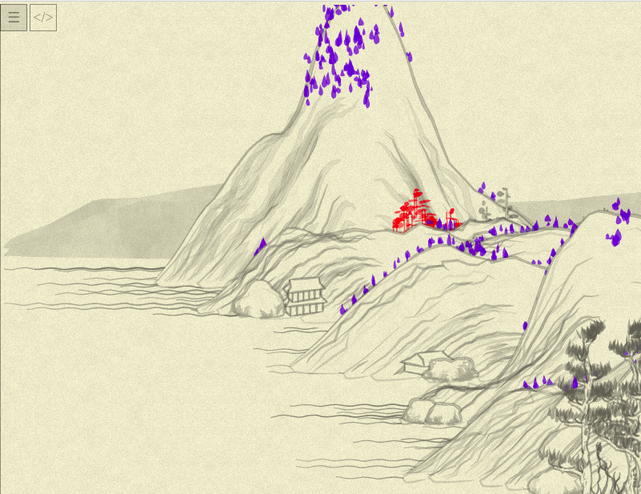
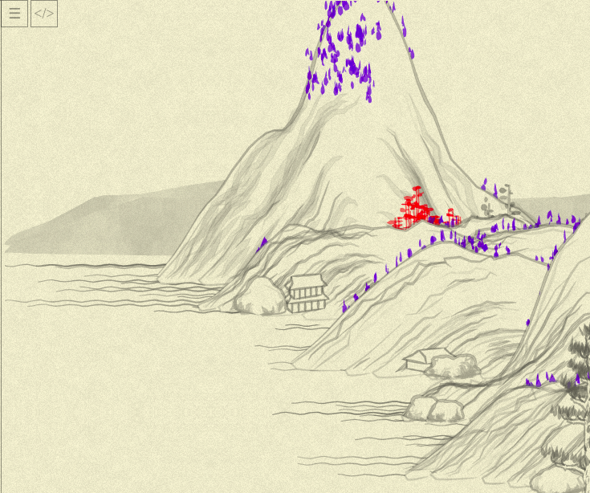
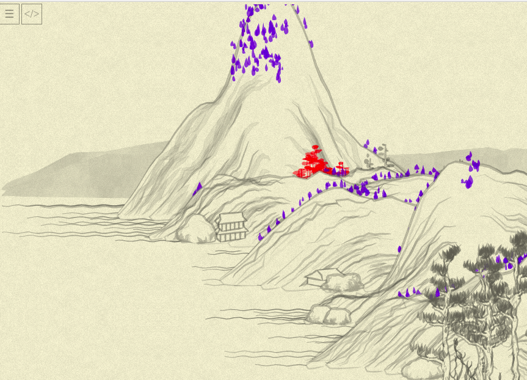

# Day 05: Moar treees!

* **Commit:** [17eece5](https://github.com/zverok/grok-shan-shui/commit/17eece56ebc29dafc18d0c2b4469d342472ad2fe)
* **Functions:**
  * [`Tree.tree01`](https://github.com/zverok/grok-shan-shui/blob/main/original.html#L744)
  * [`Tree.tree02`](https://github.com/zverok/grok-shan-shui/blob/main/original.html#L803)
  * [`blob`](https://github.com/zverok/grok-shan-shui/blob/main/original.html#L578)
* **Days about `tree01` function:** [02](day02.md)—[03](day03.md)—[04](day04.md)—**05**

For the last days, I've refactored `tree01`. I am relatively happy with the result (random shifts in blob parameters aren't that clear for me yet), but let's do more trees to see how the developed patterns and undertandings might be applied.

> Aside note: just today, I stumbled upon a [great article](https://christianheilmann.com/2021/11/01/developer-tools-secrets-that-shouldnt-be-secrets/) with tips about using browser's DevTools. The knowledge of the things you can do with `console` makes life so much easier, great timing! Thanks a lot, Christian!

`tree02` seems to be quite simple, so I'll try to do everything in as few steps as possible. First, apply distinctive color:



Oh, so it is those pine-like trunk-less trees. OK, now to rewriting the method the same way... But wait, first I backed of of my yesterday's decision that "the picture can be slightly off if the code is nicer". I want it to be close to the original, so I rewritten `tree01` again, a bit, changing "produce data => produce pictures" to one step of "produce pictures":

```js
this.tree01 = function(x, y, {height = 50, width = 3, color = rgba(100,100,100,0.5), noise = 0.5 }) {
  color = rgba(255, 0, 0, 0.5);

  resolution = 10;

  var points = range(resolution).map(i => ({x, y: y - (i * height) / resolution}))

  var trunk1 = points.map(
    (point, i) => [point.x - width / 2 + width * (Noise.noise(i * 0.5) - 0.5), point.y]
  ).and_then( points => poly_(points, { fill: "none", stroke: color, width: 1.5 }));

  var trunk2 = points.map(
    (point, i) => [point.x + width / 2 + width * (Noise.noise(i * 0.5, 0.5) - 0.5), point.y]
  ).and_then( points => poly_(points, { fill: "none", stroke: color, width: 1.5 }));

  var crowns =
    range(resolution).zip(points).slice(resolution / 4 + 1).flatMap(
      ([i, point]) => {
        to_top = resolution - i
        return range(to_top / 5).map(() => blob_(
          point.x + rand(-0.5, 0.5) * width * 1.2 * to_top,
          point.y + rand(-0.5, 0.5) * width,
          {
            length: rand(20) * to_top * 0.2 + 10,
            width: rand(6) + 3,
            angle: rand(-0.5, 0.5) * Math.PI / 6,
            color: color.merge({a: rand(0.2) + color.a}),
          },
        ))
      }
    ).join()

  return crowns + trunk1 + trunk2
};
```

`and_then` is a personal trick of mine doing just this:
```js
Object.prototype.and_then = function(f) { return f(this) }
```
...so you can chain operations with singular values the same way you chain operations with sequences:
```js
x = (2 + 3).and_then(i => i**2)
```
...which allows to clarify the "flow": instead of producing intermediate variables, we clearly show "we calculate this, than transform to that, then end with those". In our case, we specify that each line of trunk is "points calculated this way — _and then_ passed to `poly_`."

Voila! (Or "Boooo", depending on your personal taste)


But, back to `tree02`:

```js
this.tree02 = function(x, y, {height = 16, width = 8, clu = 5, color = rgba(100,100,100,0.5), noise = 0.5}) {
  color = rgba(0, 0, 255, 0.5)

  return range(clu).map( i => blob_(
   x + randGaussian() * clu * 4,
   y + randGaussian() * clu * 4,
   {
     angle: Math.PI / 2,
     fun: (x) => x <= 1 ?
                 Math.pow(Math.sin(x * Math.PI) * x, 0.5) :
                 -Math.pow(Math.sin((x - 2) * Math.PI * (x - 2)), 0.5),
     width: width * 0.5 + rand(width * 0.75),
     lenght: height * 0.5 + rand(height * 0.75),
     color: color,
   },
  )).join();
}
```

Let's look at the picture. Hmm... Not exactly:


Like, all the trees in right places and more or less right shapes, but something is off.

`tree02` code is really simple, I am recheckingthat everything is OK there... Maybe the culprit is our yesterday's `blob_`? And indeed, replacing it with `blob` (and old param names), the picture becomes identical to the target one.

After some debugging I  found a typo in my `blob_` call (see `lenght`?..) but, weirdly enough, it haven't fixed the picture.

Hmm... OK, after **a lot** of debugging is the fixed `blob_`: `loopNoise` should happen (changing noises in-place) _before_ second mapping of the noise! So, the new `blob_` code is:
```js
function blob_(x, y, {
    length = 20,
    width = 5,
    angle = 0,
    color = rgba(200, 200, 200, 0.9),
    noise = 0.5,
    render = true,
    debug = false,
    fun}) {

  fun ||= (x) => x <= 1 ? Math.pow(Math.sin(x * Math.PI), 0.5) : -Math.pow(Math.sin((x + 1) * Math.PI), 0.5)

  var resolution = 20.0;
  var las = range(resolution + 1).map( i => {
    var p = (i / resolution) * 2;
    var xo = length / 2 - Math.abs(p - 1) * length;
    var yo = (fun(p) * width) / 2;
    var a = Math.atan2(yo, xo);
    var l = Math.sqrt(xo * xo + yo * yo);
    if(debug && i == 0) { console.log({length, p, xo, yo, a, l}) }
    return [l, a];
  })

  var n0 = Math.random() * 10;
  var noises = range(resolution + 1).
                map( i => Noise.noise(i * 0.05, n0)).
                tap(loopNoise).
                map( n => n * noise + (1 - noise))

  var points = las.zip(noises).map(
    ([[l, a], n]) => [x + Math.cos(a + angle) * l * n, y + Math.sin(a + angle) * l * n]
  )
  if (debug) { console.log({las, noises, points}) }

  if (render) {
    return poly_(points, { fill: color, stroke: color, width: 0 });
  } else {
    return points;
  }
}
```
`tap` is "apply something to object and return the same object" which I got used to in Ruby:
```js
Object.prototype.tap = function(f) { f(this); return this }
```

> A note about debugging the code which generates a lot of random objects with just my `console.log`: I've temporary introduced the global (shame on me!) variable `tree02num` and increased it for each call, and passed the `debug: (tree02num == 1 && i == 0)` from the `tree02` to `blob_` and `blob`. So, only one blob printed all of its variables (you can see the `debug` parameter usage in the code above), and then I compared them and looked for the causes.

Now our picture is back (and actually red trees also demonstrated the problem, but blobs were smaller and I thought it was just color perceiving difference):



With that, `tree02` is kinda ready:
```js
this.tree02 = function(x, y, {height = 16, width = 8, clu = 5, color = rgba(100,100,100,0.5), noise = 0.5}) {
  color = rgba(0, 0, 255, 0.5)

  return range(clu).map( i => blob_(
    x + randGaussian() * clu * 4,
    y + randGaussian() * clu * 4,
    {
      angle: Math.PI / 2,
      fun: (x) => x <= 1 ?
                  Math.pow(Math.sin(x * Math.PI) * x, 0.5) :
                  -Math.pow(Math.sin((x - 2) * Math.PI * (x - 2)), 0.5),
      width: width * 0.5 + rand(width * 0.75),
      length: height * 0.5 + rand(height * 0.75),
      color: color
    },
  )).join();
};
```
...though, in all honesty, I am less happy than with `tree01`: the rewrite didn't bring any additional insight of "Oh, it works _this_ way actually": both the original and "functional" versions just say "generate some blobs with some randomness", and I am not much closer to understanding of what `clu` might mean, or how custom `fun` affects the blob (and haven't dug into `randGaussian` yet). Maybe it will become clearer down the road.

Tomorrow, to `tree03`, and then, maybe, to some other objects?
