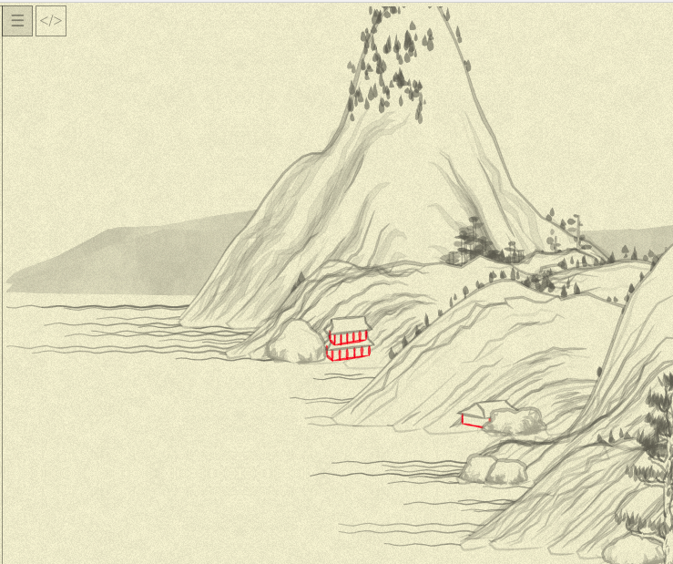
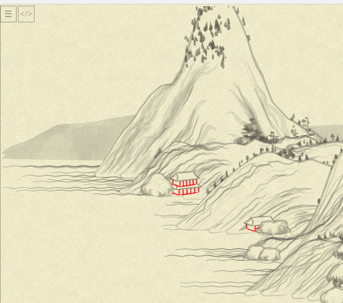
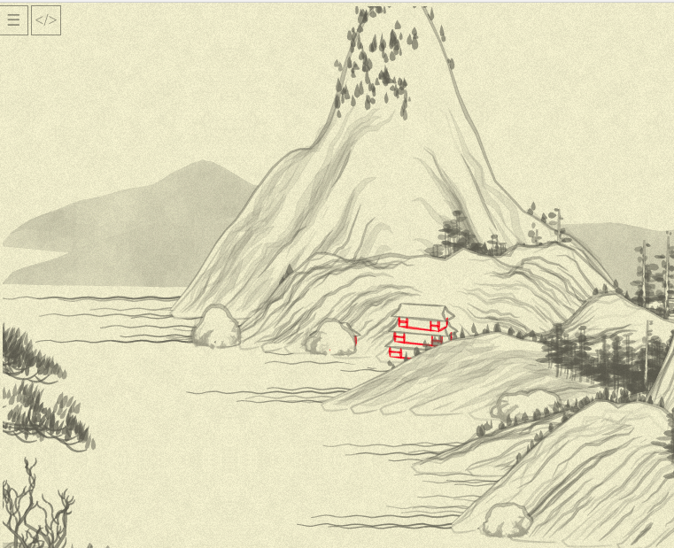

# Day 07: Build me a house

* **Commit:** [27e48fa](https://github.com/zverok/grok-shan-shui/commit/27e48fade1efa0bbcba3462366da66dd5bc7e424)
* **Functions:**
  * [`Arch.arch02`](https://github.com/zverok/grok-shan-shui/blob/main/original.html#L3061)
  * [`box`](https://github.com/zverok/grok-shan-shui/blob/main/original.html#L2609)
* **Other days about:**
  * `arch02`: **07**, [11](day11.md)
  * `box`: **07**—[08](day08.md)—[09](day09.md)—[10](day10.md)

I opened the code planning to experiment on buildings in the picture (class `Arch`) the same way I experimented with trees.

The first disappointment to wait for me was that buildings do not have `col`(or) parameter, so it is not that easy to colorize the type of buildings I am interested in, they all constantly gray. So the first obstacle was to add this parameter to the `box` function all of them use, and then pass it from one of the houses, till I found the convenient one: `arch02`:



And here we go. (Notice I returned to trees their natural color for now.)

First, as usual, update function's arguments to clean up the scene

```diff
-    this.arch02 = function(xoff, yoff, seed, args) {
-      var args = args != undefined ? args : {};
-      var hei = args.hei != undefined ? args.hei : 10;
-      var wid = args.wid != undefined ? args.wid : 50;
-      var rot = args.rot != undefined ? args.rot : 0.3;
-      var per = args.per != undefined ? args.per : 5;
-      var sto = args.sto != undefined ? args.sto : 3;
-      var sty = args.sty != undefined ? args.sty : 1;
-      var rai = args.rai != undefined ? args.rai : false;
-
-      seed = seed != undefined ? seed : 0;
+    this.arch02 = function(xoff, yoff, seed = 0,
+      {height = 10, width = 50, rotation = 0.3, per = 5, sto = 3, sty = 1, rai = false}
+    ) {
```
(Note that I can't _yet_ rename all of them, as I don't undertand what they do yet!)

Now, to the body. It seems to do the following in one big cycle (`sto` times... still don't know what that should mean!):
* add a `box`
* add a `rail` but only if `rai` parameter is passed... aha, that answers one mystery about parameter naming _(aside note: there is only one call to `arch02` in the codebase, and it never passes `rai`... so, this part is effectively moot, but I'll leave it, and rename the parameter to `has_rails`)_
* adds roof (sometimes randomly attaching `Pizza Hut` placate, which is a nice touch!)

So, can we do it in a usual `map`-style?.. Here is (half-baked) code:
```js
return range(sto).map( i => i * height * 1.5 ). // produce series of h_offsets
       map( (hoff, i) => {
         return box(xoff, yoff - hoff, {
            tra: false,
            hei: height,
            wid: width * Math.pow(0.85, i),
            rot: rotation,
            wei: 1.5,
            per: per,
            col: 'rgba(255,0,0,0.5)',
            dec: function(a) {
              return deco(
                sty,
                Object.assign({}, a, {
                  hsp: [[], [1, 5], [1, 5], [1, 4]][sty],
                  vsp: [[], [1, 2], [1, 2], [1, 3]][sty],
                }),
              );
            },
          }) +
          (has_rails ?
            rail(xoff, yoff - hoff, i * 0.2, {
              wid: width * Math.pow(0.85, i) * 1.1,
              hei: height / 2,
              per: per,
              rot: rotation,
              wei: 0.5,
              tra: false,
            })
          : '') +
          roof(xoff, yoff - hoff - height, {
            hei: height,
            wid: width * Math.pow(0.9, i),
            rot: rotation,
            wei: 1.5,
            per: per,
            pla: (sto == 1 && Math.random() < 1 / 3 ? [1, "Pizza Hut"] : undefined),
          })
       })
```
Nothing seems to be broken on the image...


...though, wait. Seems that houses are slightly _rotated_. Ugh, nevermind. There are two calls to `arch02` in code actually, and I just forgot to change the `rot`→`rotation` in one of them. Now everything should be fixed...



Wait what.

Oh, hello non-random randomness my old friend. When fixing the parameter name, I also changed the order of parameters in call, "for it to look nicer"
```diff
             return Arch.arch02(x + xoff, y + yoff, seed, {
-              wid: normRand(40, 70),
+              width: normRand(40, 70),
+              rotation: Math.random(),
               sto: randChoice([1, 2, 2, 3]),
-              rot: Math.random(),
               sty: randChoice([1, 2, 3]),
             });
```
...and now `Math.random()` for rotation is called earlier than `randChoice` for `sto`, and we broke the universe. Changing parameters order back makes houses look like on original picture.

Phew.

Now, as with `poly` and `blob` before, I'll start to copy all of those `box` etc into "my" `box_`

As usual, some nice thing happen on the road...


But eventually it all played out (again, wouldn't repeat the original pic here, it works)!

I ended up with half-rewritten `box` currently:

```js
var box_ = function(xoff, yoff,
  {
    height = 20, width = 120, rotation = 0.7, per = 4,
    transparent = true, bottom = true, weight = 3, dec = (a) => [],
    color = rgba(100,100,100,0.4)
  }
) {
  var mid = -width * 0.5 + width * rotation;
  var bmid = -width * 0.5 + width * (1 - rotation);
  var ptlist = [];
  ptlist.push(div([[-width * 0.5, -height], [-width * 0.5, 0]], 5));
  ptlist.push(div([[width * 0.5, -height], [width * 0.5, 0]], 5));
  if (bottom) {
    ptlist.push(div([[-width * 0.5, 0], [mid, per]], 5));
    ptlist.push(div([[width * 0.5, 0], [mid, per]], 5));
  }
  ptlist.push(div([[mid, -height], [mid, per]], 5));
  if (transparent) {
    if (bottom) {
      ptlist.push(div([[-width * 0.5, 0], [bmid, -per]], 5));
      ptlist.push(div([[width * 0.5, 0], [bmid, -per]], 5));
    }
    ptlist.push(div([[bmid, -height], [bmid, -per]], 5));
  }

  var surf = (rotation < 0.5) * 2 - 1;
  ptlist = ptlist.concat(
    dec({
      pul: [surf * width * 0.5, -height],
      pur: [mid, -height + per],
      pdl: [surf * width * 0.5, 0],
      pdr: [mid, per],
    }),
  );

  var polist = [
    [-width * 0.5, -height],
    [width * 0.5, -height],
    [width * 0.5, 0],
    [mid, per],
    [-width * 0.5, 0],
  ];

  var canv = "";
  if (!transparent) {
    canv += poly(polist, {
      xof: xoff,
      yof: yoff,
      str: "none",
      fil: "white",
    });
  }

  for (var i = 0; i < ptlist.length; i++) {
    canv += stroke(
      ptlist[i].map(([x, y]) => [x + xoff, y + yoff]),
      {
        col: color.toString(),
        noi: 1,
        wid: weight,
        fun: (x) => 1
      },
    );
  }
  return canv;
};
```

Some of it became clearer (names of things like `bot`→`bottom` and `tra`→`transparent`), some are still mystery (like what `dec` function does), and I'll need to look into dreadful `deco` and `div` tomorrow. They are kind of "simple", yet do a lot of math transformation with 1-2 char variables in quick succession, and to understand and explain `box`, I need first to understand them!

Till tomorrow, sleepyhead.
