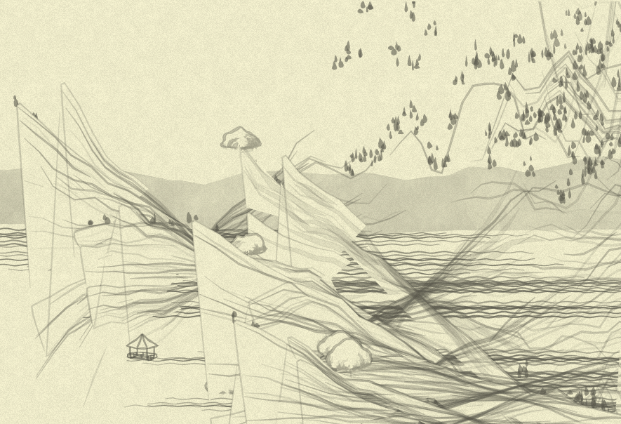

## Day 15: Between the landscape and the tree

These last days I've looked into how the overall picture got _planned_ by `mountplanner` in a series of objects consisting of a `{tag, x, y}`, now let's see how those large objects (features of the landscape) are actually drawn. This will hopefully cover the entire process from the whole picture to a singular stick on it—at least, some paths (mountains with some houses and some trees), assuming others have more or less the same logic.

You see, I am already starting to consider how I'll sum it all up for publishing: probably the series of daily diary entries as I write them, but also some digestible high-level retelling of the whole picture. Looking into some of the lately rewritten methods with a fresh eye, I still see that it wouldn't be _that_ digestible for those just wanting a quick overview of the juiciest and the most important... But we'll see.

Philosophy aside, to the `Mount.mountain`!

As always I am starting with a mechanical cleanup of the attributes and such...

```js
this.mountain = function(xoff, yoff, seed = 0,
  {height = rand(100, 500), width = rand(400, 600), tex = 200, veg = true, ret = 0, color}
) {
```

`tex`, `veg` and `ret` are a bit of a mystery, let's see later. (I also was curious when the defaults are calculated—if it would be like in Python, once calculated on definition, those randomness in height/width would be totally screwed. Fortunately, in JS it is like in Ruby, on every call.)

Now, shallow view on the method shows that it calculates some list of points, and then calls internal function `vegetate` many times to, probably, fill up the space for the mountain with various features.

On the road, as per habit, a way to screw things up (less appealing than usual...)



...but actually me changing `reso = [10, 50]` to `resolution = {x: 10, y: 50}` (and then using `resolution.x` instead of `reso[0]`) helped me to quickly find the hole in my mental model. According to usage, it was actually other way round, and `reso[0]` meant "resolution for `y`".

The first working attempt for the point list calculation gives this:

```js
var ptlist = range(resolution.y).
  map( yi => {
    hoff += rand(yoff / 100)
    return range(resolution.x).map( xi => {
      var x = (xi / resolution.x - 0.5) * Math.PI;
      var y = Math.cos(x) * Noise.noise(x + 10, yi * 0.15, seed);
      var p = 1 - yi / resolution.y;
      return [(x / Math.PI) * w * p, -y * h * p + hoff]
    })
  })
```

But being bad at math (I used to love trigonometry so much 20 years ago... and now I can't even for sure say "oh, of course it calculates an angle of _that_!") I am still kinda lost in all that. Nevertheless, I am almost sure the names should change somehow: even with my rudimentary trigonometry leftovers, I see that `x` and `y` seem to be some angles, not coordinates.

But I'll move forward for now, to the `vegetate` method and further—and then we'll see where it all leads in general.

That's what I did to `vegetate`:

```js
function vegetate(treeFunc, growthRule, proofRule) {
  canv += ptlist.
          flatMap( (points, xi) => points.filter( (point, yi) => growthRule(xi, yi) ) ).
          and_then( veglist => veglist.filter( (_, i) => proofRule(veglist, i) ) ).
          map( ([x, y]) => treeFunc(x, y) ).
          join()
}
```

So, it receives three functions:
* what to draw (named `treeFunc`, but actually the method code calls it for all picture features, architecture as lik as trees)
* how to choose "whether to draw at this point of the grid" (`growthRule`)
* how to decide "whether to really draw at this point, considering the list of points choosen" (`proofRule`)

It then filters through the grid twice with `growthRule`, then `proofRule`, and then draws! Simple.

Some observations:
* I _half-suspect_ my names for `xi` and `yi` (coordinates of the grid) are in the wrong order, considering we saw above that `ptlist` was generated `y`-first (so the outer iteration is actually by `y`s); but not sure yet, and not even sure it matters...
* I suspect we might make `growsRule`s' code simpler if we'll pass `point` to them, too—most of the time they do something like `ptlist[i][j]` somewhere inside
* The `growthRule` more complicated than `return true` is used exactly once, so it might be a special occasion? But we'll see.

In general, "we'll see" is the mood of the day: once I'll reiterate on all the real usages of this `vegetate`, I expect at least _some_ amount of insights into the way the filtering/deciding what to draw is performed.
